# MonsterMaker

**Editor de Fangames + Motor 2D en C++**

MonsterMaker es una herramienta completa de creación de fangames 2D estilo Pokémon, que combina un editor visual moderno construido con Electron y React, con un potente motor de juego desarrollado en C++ y OpenGL.


---

## Tabla de Contenidos

- [Descripción](#descripción)
- [Características Principales](#características-principales)
- [Arquitectura del Proyecto](#arquitectura-del-proyecto)
- [Tecnologías Utilizadas](#tecnologías-utilizadas)
- [Requisitos del Sistema](#requisitos-del-sistema)
- [Instalación](#instalación)
- [Estructura del Proyecto](#estructura-del-proyecto)
- [Diagrama de Arquitectura](#diagrama-de-arquitectura)
- [Uso](#uso)
- [Documentación](#documentación)
- [Testing](#testing)
- [Roadmap](#roadmap)
- [Contribuir](#contribuir)
- [Licencia](#licencia)

---

## Descripción

MonsterMaker es una herramienta especializada para crear videojuegos 2D estilo Pokémon sin necesidad de programar en C++. El proyecto está diseñado como un Trabajo de Fin de Grado (TFG) y se compone de dos componentes principales que trabajan en conjunto:

### 🖥️ Editor Visual (Game Editor)

Aplicación de escritorio desarrollada con Electron y React que proporciona una interfaz gráfica intuitiva para:

- Crear y editar mapas 2D basados en tiles
- Gestionar sprites, tilesets y animaciones
- Configurar entidades, eventos y comportamientos del juego
- Administrar todos los recursos (assets) del proyecto
- Generar archivos de configuración en formato JSON
- Compilar automáticamente el proyecto final

### ⚙️ Motor del Juego (Game Engine)

Motor 2D de alto rendimiento escrito en C++ con OpenGL que:

- Renderiza gráficos 2D: tilemaps, sprites y efectos visuales
- Ejecuta la lógica del juego mediante un sistema de estados
- Carga y procesa los datos generados por el editor
- Soporta scripting en Lua para lógica personalizada
- Produce ejecutables finales optimizados del juego

El editor genera archivos JSON que el motor C++ lee y procesa, permitiendo al usuario compilar su fangame directamente desde la interfaz del editor.

---

## Características Principales

### Editor de Juegos

- **Editor de Tilemaps**: Construcción visual de mapas con sistema de capas
- **Gestor de Assets**: Organización centralizada de sprites, tilesets y recursos
- **Sistema de Eventos**: Configuración de triggers y comportamientos sin código
- **Previsualización en Tiempo Real**: Visualiza cambios instantáneamente
- **Exportación de Proyectos**: Genera estructura completa y compilable
- **Gestión de Estado con Zustand**: Manejo eficiente del estado de la aplicación

### Motor del Juego

- **Renderizado OpenGL**: Gráficos 2D optimizados y eficientes
- **Sistema ECS**: Arquitectura Entity-Component-System para máxima flexibilidad
- **Gestión de Estados**: Sistema robusto para exploración, combate, menús, etc.
- **Scripting con Lua**: Extensión de lógica del juego mediante scripts
- **Sistema de Audio**: Integración con SoLoud para música y efectos de sonido
- **Gestión de Recursos**: Carga optimizada de texturas, sonidos y fuentes
- **Sistema de Input**: Manejo completo de teclado y ratón
- **UI con RmlUI**: Interfaz de usuario declarativa y personalizable

---

## Arquitectura del Proyecto

MonsterMaker sigue una arquitectura de dos capas claramente diferenciadas:

```
┌─────────────────────────────────────────────────────────────┐
│                      EDITOR (Electron)                       │
│  ┌────────────┐  ┌──────────┐  ┌─────────────────────────┐ │
│  │   React    │  │ Zustand  │  │      Node.js            │ │
│  │    UI      │─▶│  State   │─▶│  File Management        │ │
│  └────────────┘  └──────────┘  └─────────────────────────┘ │
│         │                                    │               │
│         └────────────────┬───────────────────┘               │
└──────────────────────────┼─────────────────────────────────┘
                           │ JSON Files
                           ▼
┌─────────────────────────────────────────────────────────────┐
│                   MOTOR (C++ / OpenGL)                       │
│  ┌──────────┐  ┌──────────┐  ┌──────────┐  ┌────────────┐ │
│  │ Renderer │  │   ECS    │  │  States  │  │    Lua     │ │
│  │ (OpenGL) │  │  System  │  │  Manager │  │  Scripting │ │
│  └──────────┘  └──────────┘  └──────────┘  └────────────┘ │
└─────────────────────────────────────────────────────────────┘
```

### Flujo de Trabajo

1. El usuario crea y edita su juego en el **Editor Visual**
2. El editor genera archivos **JSON** con la configuración del juego
3. El **Motor C++** lee estos archivos y construye el juego
4. El motor se **compila automáticamente** desde el editor
5. Se genera un **ejecutable final** jugable

---

## Tecnologías Utilizadas

### Editor Visual (Frontend)

| Tecnología | Propósito |
|-----------|-----------|
| **Electron** | Aplicación de escritorio multiplataforma |
| **React 18+** | Interfaz de usuario modular y reactiva |
| **TypeScript** | Tipado estático para mayor robustez |
| **Zustand** | Gestión de estado global simplificada |
| **HTML/CSS** | Diseño y estilos de la interfaz |

### Backend del Editor

| Tecnología | Propósito |
|-----------|-----------|
| **Node.js** | Procesos del sistema y gestión de archivos |
| **File System API** | Lectura y escritura de proyectos |

### Motor del Juego (Game Engine)

| Tecnología | Propósito |
|-----------|-----------|
| **C++17/20** | Lenguaje base del motor |
| **OpenGL** | Renderizado de gráficos 2D |
| **GLFW** | Gestión de ventanas y entrada |
| **GLM** | Matemáticas para gráficos |
| **stb_image** | Carga de imágenes |
| **SoLoud** | Sistema de audio |
| **Lua** | Scripting para eventos y lógica personalizada |
| **sol2** | Bindings C++ ↔ Lua |
| **nlohmann/json** | Parseo de archivos JSON |
| **RmlUI** | Sistema de interfaz de usuario |
| **CMake** | Sistema de compilación |
| **vcpkg** | Gestión de dependencias |

### Documentación y Testing

| Herramienta | Propósito |
|------------|-----------|
| **Fumadocs** | Documentación del editor y motor |
| **Stagehand** | Testing E2E del editor |

---

## Requisitos del Sistema

### Para el Editor

- **Sistema Operativo**: Windows 10/11, macOS 10.15+, Linux
- **Node.js**: v18 o superior
- **npm**: v9 o superior
- **RAM**: Mínimo 4GB (recomendado 8GB)

### Para el Motor

- **Compilador**: 
  - Windows: Visual Studio 2019+ con C++17
  - Linux: GCC 9+ o Clang 10+
  - macOS: Xcode 12+ con Command Line Tools
- **CMake**: v3.20 o superior
- **vcpkg**: Última versión
- **OpenGL**: 3.3 o superior
- **RAM**: Mínimo 2GB

---

## Instalación

### 1. Clonar el Repositorio

```bash
git clone https://github.com/usuario/monstermaker.git
cd monstermaker
```

### 2. Instalar el Editor

```bash
cd editor
npm install
npm run build
```

### 3. Configurar el Motor

#### Instalar vcpkg (si no está instalado)

```bash
git clone https://github.com/Microsoft/vcpkg.git
cd vcpkg
./bootstrap-vcpkg.sh  # Linux/macOS
# o
bootstrap-vcpkg.bat   # Windows
```

#### Compilar el Motor

```bash
cd engine
mkdir build && cd build
cmake .. -DCMAKE_TOOLCHAIN_FILE=[ruta-a-vcpkg]/scripts/buildsystems/vcpkg.cmake
cmake --build . --config Release
```

### 4. Ejecutar el Editor

```bash
cd editor
npm start
```

### Arquitectura del Motor (UML)

```mermaid
classDiagram

    Application "1"-- "1" Engine
    Engine -- InputManager
    Application "1"--"1" StateManager
    StateManager "1"--"*" State

    State <|-- ExplorationState
    State <|-- CombatState
    State <|-- MenuState
    State <|-- InventoryState
    State <|-- MenuPokemonState
    State <|-- PokemonState
    
    EntityManager "1"-- * State
    EntityManager "*"--"*" Entity
    Entity "*"--"*" Component
    Application "1"-- "1" ScriptEngine
    ScriptBindings "1"-- "1" ScriptEngine
    State -- EntityLoader
    
    Application  -- AudioService
    AudioService ..> ResourceManager 
    AudioService  --  ScriptBindings 

    class AudioService {
        <<singleton>>
        -Soloud m_soloud
        -Bus m_musicBus
        -Bus m_sfxBus
        -WavStream m_musicStream
        -int m_musicHandle
        +getInstance()$ AudioService&
        +init() void
        +shutdown() void
        +setMasterVolume(float volume) void
        +setMusicVolume(float volume) void
        +setSfxVolume(float volume) void
        +playMusic(string path, bool loop) void
        +stopMusic() void
        +pauseMusic(bool paused) void
        +playSound(string path) void
    }

    class ResourceManager {
        <<static>>
        -unordered_map~string, unique_ptr~Wav~~ m_sounds
        +loadTexture(string path)$ Texture*
        +loadSound(string path)$ Wav*
        +loadFont(string path, int size)$ TextRenderer*
    }
   
    class EntityLoader {
        <<static>>
        +loadEntitiesFromFile(string filePath, EntityManager& entityManager) void
        -parseEntity(json entityJson, EntityManager& entityManager) void
        -createPositionComponent(json data) unique_ptr~Component~
        -createRenderComponent(json data) unique_ptr~Component~
        -createColliderComponent(json data) unique_ptr~Component~
    }
    
    class ScriptEngine {
        <<singleton>>
        -sol::state m_lua
        +getInstance()$ ScriptEngine&
        +init() void
        +setupBindingsStatic() void
        +setupBindingsDynamic(Camera* cam, EntityManager& em) void
        +runScript(string filePath) bool
        +getState() sol::state&
    }

    class ScriptBindings {
        <<static>>
        +registerStatic(sol::state& lua)$ void
        +registerDynamic(sol::state& lua, Camera* cam, EntityManager& em)$ void
        -registerKeys(sol::state& lua)
        -registerEntity(sol::state& lua)
        -registerComponents(sol::state& lua)
    }
    
    class Component {
        <<abstract>>
        -Entity* m_entity
        +update(int  deltaTime)*
        +getOwner() Entity*
        +setOwner(Entity* entity) void
        +render()*  
    }
    
    class EntityManager {
        -vector~unique_ptr~Entity~~ m_entities
        +EntityManager()
        +createEntity() Entity*
        +updateEntities(int deltaTime)
        +renderEntities()
        +getEntitiesByComponent(ComponentsType type) vector~Entity*~
    }
    
    class Entity {
        -unordered_map~ComponentsType, unique_ptr~Component~ m_components
        +addComponent(unique_ptr~Component~, ComponentsType type) void
        +getComponent(ComponentsType type) Component*
        +update(int deltaTime)
        +hasComponent(ComponentsType type) bool
        +render() 
    }

    class StateManager {
        -stack m_stateStack
        +renderCurrentState()
        +updateCurrentState(int deltaTime)
        +pushState(State* state)
        +popState()
        +getCurrentState() State*
    }

    class State {
        <<abstract>>
        -StateManager* m_stateManager
        -EntityManager* m_entityManager
        -setEntityManager()*
        +onEnter() void*
        +render()*
        +update(int deltaTime)*
        +setStateManager(StateManager* stateManager) void*
        +getEntityManager() EntityManager*
    }

    class ExplorationState {
        +update(int deltaTime) override
        +render() override
        +setEntityManager() override
    }

    class CombatState {
    }
    
    class MenuState {
    }
    
    class InventoryState {
    }

    class MenuPokemonState {
    }

    class PokemonState {
    }

    class Application{
        -StateManager m_stateManager
        -Engine m_engine 
        +render()
        +update()
        +run()
    }
    
    class Engine{
        -int m_width
        -int m_height
        -string m_title
        -std::unique_ptr<Camera> m_camera
        -GLFWwindow m_window
        -void setUpShaders()
        -void setUpCamera()
        +Engine()
        +startLoop()
    }

    class InputManager {
        -InputManager* instance$
        -GLFWwindow* window
        -unordered_map~int, bool~ currentKeyState
        -unordered_map~int, bool~ previousKeyState
        -InputManager(GLFWwindow* window)
        -updateKeyStates()
        +initialize(GLFWwindow* window)$ void
        +getInstance()$ InputManager&
        +resetInstance()$ void
        +isKeyDown(int key) bool
        +isKeyPressed(int key) bool
        +isKeyReleased(int key) bool
        +update() void
        +getMousePosition() glm::vec2
        +isMouseButtonDown(int button) bool
    }
```



### Componentes Principales

#### Application
Punto de entrada principal del motor. Gestiona el ciclo de vida de la aplicación y coordina el `Engine`, `StateManager`, `ScriptEngine` y `AudioService`.

#### Engine
Núcleo del motor gráfico. Maneja la ventana GLFW, la cámara, los shaders y el bucle principal de renderizado.

#### StateManager
Gestiona una pila de estados del juego (exploración, combate, menús, etc.), permitiendo transiciones fluidas entre diferentes modos de juego.

#### Entity Component System (ECS)
- **Entity**: Contenedor genérico de componentes
- **Component**: Comportamientos modulares (posición, renderizado, colisión, etc.)
- **EntityManager**: Gestiona el ciclo de vida de todas las entidades

#### ScriptEngine
Motor de scripting Lua que permite extender la funcionalidad del juego sin recompilar. Incluye bindings para entidades, componentes y sistemas del motor.

#### AudioService
Sistema de audio basado en SoLoud con soporte para música de fondo, efectos de sonido y control de volumen independiente.

#### ResourceManager
Gestión centralizada de recursos (texturas, sonidos, fuentes) con caché automático para optimizar el rendimiento.

---

## Uso

### Crear un Nuevo Proyecto

1. Abre el editor MonsterMaker
2. Selecciona "Nuevo Proyecto"
3. Configura el nombre y la ubicación del proyecto
4. El editor generará la estructura base del proyecto

### Editar Mapas

1. Navega a la sección "Maps" en el editor
2. Carga un tileset desde "Assets"
3. Utiliza las herramientas de pincel para construir tu mapa
4. Configura colisiones y propiedades de tiles
5. Guarda el mapa (se generará un archivo JSON)

### Añadir Eventos

1. Selecciona un tile o área del mapa
2. Haz clic en "Add Event"
3. Configura el trigger (interacción, colisión, etc.)
4. Escribe el script Lua asociado o selecciona una acción predefinida

### Ejemplo de Script Lua

```lua
-- Script de evento: puerta que cambia de mapa
function onInteract(entity)
    if entity.hasComponent("Player") then
        changeMap("town_interior", 5, 10)
        playSound("assets/sounds/door.wav")
    end
end
```

### Compilar el Juego

1. Haz clic en "Build" en el menú principal
2. El editor invocará CMake para compilar el motor
3. Se generará un ejecutable en la carpeta `build/`
4. El juego estará listo para distribuir

---

## Documentación

La documentación completa del proyecto está desarrollada con **Fumadocs** y se divide en:

- **Guía del Usuario**: Cómo usar el editor para crear juegos
- **Referencia de la API**: Documentación de las clases y funciones del motor
- **Scripting con Lua**: Guía completa de scripting y ejemplos
- **Arquitectura del Sistema**: Descripción detallada de la arquitectura

Para acceder a la documentación:

```bash
cd docs
npm install
npm run dev
```

La documentación estará disponible en `http://localhost:3000`

---

## Testing

### Tests del Editor (E2E con Stagehand)

```bash
cd tests/editor
npm install
npm test
```

Los tests E2E cubren:
- Creación de proyectos
- Edición de mapas
- Gestión de assets
- Compilación del motor

### Tests del Motor (C++)

```bash
cd engine/tests
mkdir build && cd build
cmake ..
cmake --build .
ctest
```

---

## Roadmap

### Versión 0.1.0 (Actual)
- ✅ Editor básico de tilemaps
- ✅ Sistema ECS del motor
- ✅ Renderizado OpenGL 2D
- ✅ Gestión de estados del juego
- ✅ Integración básica de Lua

### Versión 0.2.0 (Próxima)
- 🔲 Editor de animaciones
- 🔲 Sistema de diálogos
- 🔲 Editor de combates
- 🔲 Mejoras en el sistema de eventos

### Versión 0.3.0
- 🔲 Sistema de inventario
- 🔲 Editor de estadísticas de monstruos
- 🔲 Sistema de guardado/carga

### Versión 1.0.0 (Release TFG)
- 🔲 Documentación completa
- 🔲 Proyecto de ejemplo completo
- 🔲 Optimizaciones de rendimiento
- 🔲 Testing exhaustivo

---

## Contribuir

Este proyecto es parte de un Trabajo de Fin de Grado (TFG) y actualmente no acepta contribuciones externas. Sin embargo, puedes:

- Reportar bugs a través de Issues
- Sugerir características nuevas
- Hacer fork del proyecto para tus propios propósitos educativos

---

## Licencia

Este proyecto está licenciado bajo la Licencia MIT. Consulta el archivo `LICENSE` para más detalles.

**MonsterMaker** - Creando fangames con pasión y tecnología moderna.
