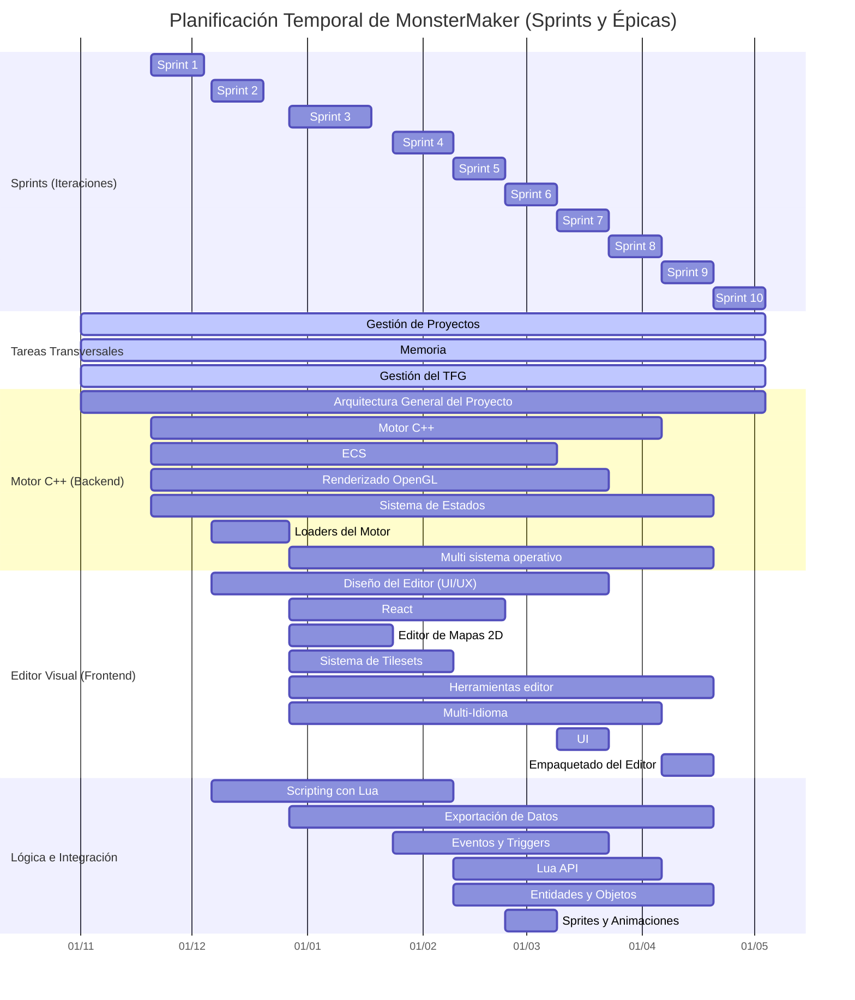

```mermaid
gantt
    title Planificación Temporal de MonsterMaker (Sprints y Épicas)
    dateFormat YYYY-MM-DD
    axisFormat %d/%m

    section Sprints (Iteraciones)
        Sprint 1 :s1, 2025-11-20, 14d
        Sprint 2 :s2, 2025-12-06, 14d
        Sprint 3 :s3, 2025-12-27, 22d
        Sprint 4 :s4, 2026-01-24, 16d
        Sprint 5 :s5, 2026-02-09, 14d
        Sprint 6 :s6, 2026-02-23, 14d
        Sprint 7 :s7, 2026-03-09, 14d
        Sprint 8 :s8, 2026-03-23, 14d
        Sprint 9 :s9, 2026-04-06, 14d
        Sprint 10 :s10, 2026-04-20, 14d

    section Tareas Transversales
        Gestión de Proyectos :active, t1, 2025-11-01, 2026-05-04
        Memoria :active, t2, 2025-11-01, 2026-05-04
        Gestión del TFG :active, t3, 2025-11-01, 2026-05-04

    section Motor C++ (Backend)
        Arquitectura General del Proyecto :m1, 2025-11-01, 2026-05-04
        Motor C++ :m2, 2025-11-20, 2026-04-06
        ECS :m3, 2025-11-20, 2026-03-09
        Renderizado OpenGL :m4, 2025-11-20, 2026-03-23
        Sistema de Estados :m5, 2025-11-20, 2026-04-20
        Loaders del Motor :m6, 2025-12-06, 2025-12-27
        Multi sistema operativo :m7, 2025-12-27, 2026-04-20

    section Editor Visual (Frontend)
        Diseño del Editor (UI/UX) :e1, 2025-12-06, 2026-03-23
        React :e2, 2025-12-27, 2026-02-23
        Editor de Mapas 2D :e3, 2025-12-27, 2026-01-24
        Sistema de Tilesets :e4, 2025-12-27, 2026-02-09
        Herramientas editor :e5, 2025-12-27, 2026-04-20
        Multi-Idioma :e6, 2025-12-27, 2026-04-06
        UI :e7, 2026-03-09, 2026-03-23
        Empaquetado del Editor :e8, 2026-04-06, 2026-04-20

    section Lógica e Integración
        Scripting con Lua :l1, 2025-12-06, 2026-02-09
        Exportación de Datos :l2, 2025-12-27, 2026-04-20
        Eventos y Triggers :l3, 2026-01-24, 2026-03-23
        Lua API :l4, 2026-02-09, 2026-04-06
        Entidades y Objetos :l5, 2026-02-09, 2026-04-20
        Sprites y Animaciones :l6, 2026-02-23, 2026-03-09
```